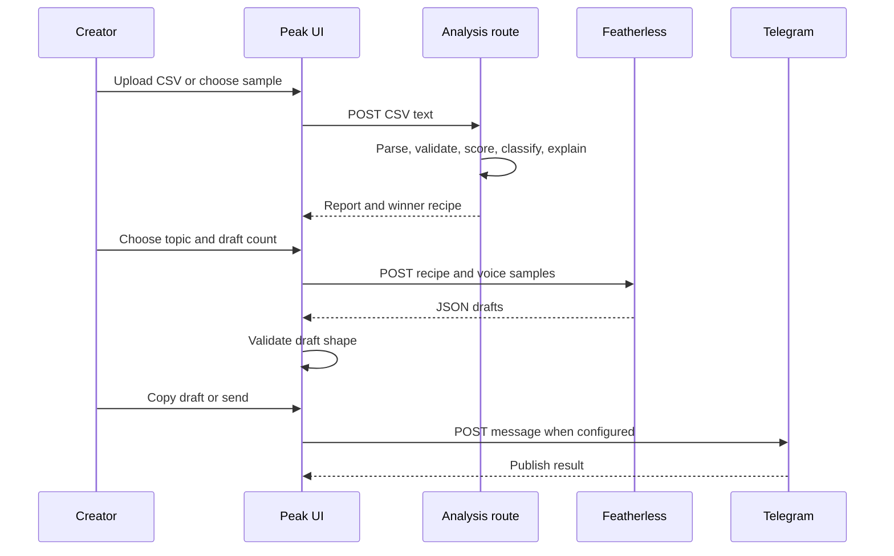

<div align="center">
  
  <h1>Peak</h1>
  <p><strong>Find your peak. Post it again.</strong></p>
  <p>Peak turns a creator's post history into a clear performance diagnosis, a repeatable content recipe, and a week of drafts shaped by their own winners.</p>

  <p>
    <a href="https://social-media-automation-hacks.devpost.com/"></a>
    <a href="https://peak.sithunyein.com"></a>
    <a href="LICENSE"></a>
    <a href="package.json"></a>
    <a href="tests/engine.test.ts"></a>
  </p>
</div>

## The problem

Creators can see that a post performed badly, but most tools stop at reporting the number. They do not explain the difference between a creator's own strong and weak posts in plain language, and they do not turn that learning into the next piece of content.

Peak closes that loop:

> **Your winners become a recipe. Your misses become lessons. Your next week follows the evidence.**

## Who Peak is for

- Solo creators who want a useful answer from their existing analytics export.
- Editors and content strategists who need a fast postmortem before planning the next week.
- Small creator teams that want a repeatable writing brief based on one account's actual history.
- Hackathon judges who need to see a real, working automation path without a paid social API.

Peak is intentionally not a social network manager or a replacement for a full publishing suite. It focuses on the reasoning step between analytics and the next draft.

## What Peak does

1. **Import** a CSV export of posts and metrics. The standard X analytics shape works, and a sample CSV is bundled for a one-click test.
2. **Measure** engagement rate from impressions and engagements instead of trusting a supplied rate column.
3. **Diagnose** hits and misses against the creator's own baseline. Misses receive plain-language explanations based on length, opening, hashtags, timing, and baseline performance.
4. **Extract a recipe** from winning posts: opening patterns, length range, hashtag count, stronger days and hours, media usage, and voice samples.
5. **Generate drafts** with Featherless using the extracted recipe and winning examples. Each draft includes a short reason and suggested publishing time.
6. **Publish manually or to Telegram** by copying one post, copying the set, or sending a post to a configured Telegram chat.

The analysis path is deterministic. If the model is unavailable, the report and recipe still work.

## Architecture

```mermaid
flowchart LR
    U[Creator] --> UI[Peak web app\nNext.js + React]
    UI -->|CSV text| API[Next.js route handlers]
    API --> PARSE[CSV parser\nX header aliases]
    PARSE --> ENGINE[Deterministic analysis engine]
    ENGINE --> REPORT[Report + misses + recipe]
    REPORT --> UI
    UI -->|Recipe + focus| GEN[/api/generate]
    GEN --> FEATHER[Featherless\nOpenAI-compatible API]
    FEATHER --> DRAFTS[Validated drafts\ntext + reason + time]
    DRAFTS --> UI
    UI --> CLIP[Clipboard]
    UI --> PUB[/api/publish]
    PUB --> TELEGRAM[Telegram Bot API]

    SAMPLE[(public/sample-export.csv)] --> UI
    ENV[(Server environment\nAPI keys)] -.-> GEN
    ENV -.-> PUB
```

### Request boundaries

- `/api/analyze` receives CSV text, parses it, and returns the computed report. It does not call Featherless or Telegram.
- `/api/generate` receives the extracted recipe and calls Featherless using the server-side API key. The key is never sent to the browser.
- `/api/publish` receives one text value and calls Telegram only when both Telegram variables are configured.
- There is no database, account system, X OAuth flow, or background scheduler in this version.

## Product flow



## Live product

**https://peak.sithunyein.com**

The fastest path is **Explore with sample data**. It runs the same CSV parser, analysis engine, report UI, and Featherless generation route used for an uploaded export.

## Local setup

### Requirements

- Node.js 20 or newer recommended.
- npm.
- A Featherless API key for draft generation. Import and analysis work without it.
- Optional Telegram bot credentials for Telegram publishing.

### Install and run

```bash
git clone https://github.com/thesithunyein/peak.git
cd peak
npm install
cp .env.example .env.local
npm run dev
```

Open [http://localhost:3000](http://localhost:3000).

For a production-like local check:

```bash
npm run build
npm start
```

### Environment variables

| Variable | Required | Description |
| --- | --- | --- |
| `FEATHERLESS_API_KEY` | Only for Generate | Server-side Featherless bearer token. |
| `FEATHERLESS_MODEL` | No | Defaults to `Qwen/Qwen2.5-72B-Instruct`. |
| `FEATHERLESS_BASE_URL` | No | Defaults to `https://api.featherless.ai/v1`. Useful for a compatible provider. |
| `TELEGRAM_BOT_TOKEN` | Only for Telegram | Token from Telegram's BotFather. |
| `TELEGRAM_CHAT_ID` | Only for Telegram | Target channel username or chat ID. The bot must have permission to post. |

Never commit `.env.local`. The repository ignores environment files and includes only the empty `.env.example` template.

## Using your own CSV

1. Export your own post history and metrics from the X analytics dashboard.
2. Confirm the CSV includes the post text, time, impressions, and engagements columns.
3. Upload the file in Peak.
4. Review the baseline, hits, misses, autopsies, and recipe.
5. Generate drafts and copy them to your normal publishing tool, or optionally send them to Telegram.

Peak accepts the standard X analytics aliases including `Tweet text`, `Time`, `Impressions`, `Engagements`, `Likes`, `Replies`, `Retweets`, `URL clicks`, `User profile clicks`, `Media views`, and `Video views`.

No X API key or X developer payment is needed for the CSV path. Direct X account connection and automatic X scheduling are intentionally out of scope because they require a separate paid API integration.

## Analysis rules

- Engagement rate is recomputed as `engagements / impressions * 100`.
- Posts with zero impressions are retained by parsing but excluded from the baseline calculation.
- At least 10 posts with impressions are needed for hit and miss classification.
- With enough data, the top quartile is a hit and the bottom quartile is a miss. The middle is average.
- The recipe uses hits only when hits exist. On a small sample, the UI clearly labels the result as a rough read.
- Autopsies report up to two strongest signals rather than pretending to know a single causal explanation.

These are useful heuristics, not a claim of causal scientific attribution.

## Security and privacy

### Current protections

- Featherless and Telegram secrets are read only on the server.
- `.env.local` and other environment files are ignored by Git.
- The browser never receives the Featherless API key or Telegram bot token.
- The app has no database and does not persist uploaded CSVs as user records.
- CSV parsing and analysis happen through the application's own API route. Draft generation receives the recipe and voice samples selected by the app.
- Invalid CSV input is rejected with a clear `400` response.

### Important production limitations

This hackathon version does not include user accounts, authentication, per-user authorization, rate limiting, abuse prevention, encrypted data storage, or an audit log. A public deployment should not be treated as a secure multi-tenant workspace for confidential data until those controls are added.

Before a larger launch, add:

1. Authentication and per-user data isolation.
2. Request size limits and rate limiting on every API route.
3. Abuse protection and model-cost quotas on `/api/generate`.
4. Structured server logs without recording post text or secrets.
5. Secret rotation and deployment-environment separation.
6. A privacy policy and an explicit retention decision.

Report security issues privately to the repository owner rather than opening a public issue with credentials or private content.

## Project structure

```text
peak/
├── public/
│   ├── logo.png                 # Peak mark used by the web app and README
│   └── sample-export.csv        # Bundled real-shaped CSV for the demo path
├── src/
│   ├── app/
│   │   ├── api/
│   │   │   ├── analyze/route.ts # CSV validation and deterministic report API
│   │   │   ├── generate/route.ts# Featherless draft API
│   │   │   └── publish/route.ts # Telegram publish API
│   │   ├── app/page.tsx          # Product flow state machine
│   │   ├── globals.css           # Background video and visual system
│   │   ├── layout.tsx            # Metadata, fonts, and root layout
│   │   └── page.tsx              # Landing page
│   ├── components/
│   │   ├── generate.tsx          # Draft count, topic, and generation UI
│   │   ├── how-it-works.tsx      # Landing-page FAQ dialog
│   │   ├── publish.tsx           # Copy and Telegram publishing UI
│   │   ├── report.tsx            # Diagnosis and recipe UI
│   │   ├── ui.tsx                # Navigation, background, cards, controls
│   │   └── upload.tsx            # CSV dropzone and sample download
│   └── lib/
│       ├── autopsy.ts            # Plain-language miss explanations
│       ├── csv.ts                # RFC4180 parser and X aliases
│       ├── llm.ts                # Featherless request and JSON validation
│       ├── metrics.ts            # Rates, percentiles, time helpers
│       ├── postmortem.ts         # Report orchestration and classification
│       ├── recipe.ts              # Winner pattern extraction
│       ├── telegram.ts            # Telegram API client
│       └── types.ts               # Shared domain types
├── tests/
│   └── engine.test.ts            # Core parser and analysis tests
├── .env.example
├── eslint.config.mjs
├── LICENSE
├── next.config.ts
├── package.json
├── postcss.config.mjs
├── README.md
└── tsconfig.json
```

## Scripts

```bash
npm run dev       # Start the development server
npm run build     # Create a production build
npm start         # Start the production server
npm run lint      # Run ESLint
npm test          # Run Vitest
```

## Verification

The current repository and live deployment were checked end to end:

- Live homepage and app route return HTTP 200.
- Bundled sample CSV returns 24 parsed posts, 24 valid posts, 6 hits, and 6 misses.
- The live Featherless route returns a real draft with text and a reason.
- Invalid CSV returns HTTP 400 with missing-column feedback.
- TypeScript, ESLint, Vitest, and the production build pass locally.

## License

Peak is released under the [MIT License](LICENSE).

## Acknowledgements

- [Next.js](https://nextjs.org/)
- [Tailwind CSS](https://tailwindcss.com/)
- [Featherless](https://featherless.ai/)
- [Telegram Bot API](https://core.telegram.org/bots/api)
- [Vitest](https://vitest.dev/)
